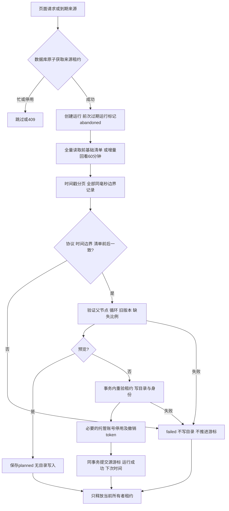

# 组织同步协议与故障恢复

适用：Git 标签 v1.0.0，2026-10-06（协议实现始于 2026-10-04）。通用功能，不含客户业务映射。

## 协议与数据所有权

只调用 HTTPS POST `/api/sys-organization/sysSynchroGetOrg/getElementsBaseInfo` 和 `getUpdatedElements`。客户端允许 token 方法但同步流程不使用节点缓存 token。Basic 鉴权、严格 TLS 校验、禁止重定向、45 秒超时；响应要求 HTTP 成功、returnState=2、count 与记录数一致，message 的 JSON 字符串二次解析。

org/dept/person/post/group 对应 company/department/person/position/group；外部 ID 在同一来源内唯一，类型变化拒绝应用。只保存名称、编码、联系资料、父 ID、源状态、排序、修改时间及 posts/thisLeader/superLeader/members 的 ID 引用。关系引用不映射权限，任意 customProps 和源 password 均丢弃。

IAM 目录字段由来源管理，宿主不应直接修改这些字段；本地登录、角色、授权及财务范围由宿主管理。采用单来源事务应用，预览只用于评估，本轮应用重新验证真实目录状态。当前规模内完整明细在内存归一处理，不落盘暂存原始响应，设置页数、记录数上限；超出规模应增加分阶段存储与版本发布机制。

## 全量与增量

全量以空 beginTimeStamp 开始，前后基础清单比较 ID、类型、名称，并与实际详情 ID 集合核对。详情时间必须大于请求边界且不超过回复 timeStamp，回复边界必须等于本页最大 alterTime。不是数据库快照；读取期间发生变化时安全失败并稍后重试，不据此批量停用。

默认页大小 200，达到页大小继续下一页，少于页大小结束；源返回边界同毫秒的超额记录不截断。严格不前进的时间、重复或乱序记录阻断。空页 timeStamp 不能证明有源记录，只保持原游标。

缺失只能在完整全量核对后标记 is_present=false、is_available=false，不硬删除。默认缺失比例超过 10% 阻断，管理员核实来源权限与清单后才调整策略；不能用调大阈值掩盖分页遗漏。有效人员缺组织、循环或父节点不存在均阻断；源明确失效且父为空的人员可保留。

## 故障恢复

| 状态/代码 | 行为与处置 |
| --- | --- |
| source_busy_or_disabled | 不创建新运行，检查来源启用与租约；不要绕过所有者校验 |
| lease_lost | 旧进程停止提交，不释放新所有者租约 |
| initialization_failure | 初始化失败，finally 释放自有租约；检查游标和配置 |
| http_401/403、business_failure | 检查接口鉴权/权限，只保存固定码，不打印原响应 |
| full_manifest_mismatch | 目录变化或缺页，游标不动，到期重试全量 |
| invalid_timestamp / 时间边界错误 | 检查来源协议，不以本机当前时间补游标 |
| directory_apply_failure | 目录关系、类型/旧版本、缺失阈值或保护策略冲突，事务回滚；先 dry-run 并核对源清单 |
| abandoned | 旧租约过期被新进程恢复，没有部分目录提交 |

一般失败按来源增量周期延迟重试，手工 full 请求保留到成功。APP_KEY 丢失会导致密码无法解密，需恢复密钥或安全重设来源凭据。没有自动 HTTP 即时重试风暴、通用消息队列、冲突修复写接口或业务公司投影；页面请求使用数据库 requested_mode 与调度器异步执行。

## 实际验证范围

23 项独立 Testbench 测试、114 断言通过：Laravel 13.34.0、Spatie 7.4.2、PHPUnit 13.3.6。资金宿主 Laravel 12.69.3、Spatie 6.25.0 中包含 15 项同步测试，完整宿主 79 项测试/412 断言通过。IAM 默认关闭回归 93 项/256 断言，Laravel 13.19.0。

涵盖全类型、密文/白名单、重复全量、改名/调动/联系清空、同毫秒边界、空页、dry-run、失败保护、清单缺页、循环、异常缺失、小幅缺失软停用、失效空父、互斥/过期恢复/租约丢失、托管账号/缺失撤销 token、拒绝复活自动登录、账号绑定冲突、受保护管理员及后置角色保护、页面权限/异步 full 请求、周期全量选择、无效初始化、重定向与损坏 JSON。

测试均确认唯一临时 SQLite 文件，用普通 migrate，不 fresh、wipe、删表或迁移回滚。实际远端全量/增量及页面/进程验证记录在宿主报告；未修改远端组织以验证真实改名/离职。Laravel 11、MySQL/PostgreSQL、正式队列/cron部署、超大规模和真实多节点改变尚未验收，不由依赖声明或 SQLite 测试推定。
